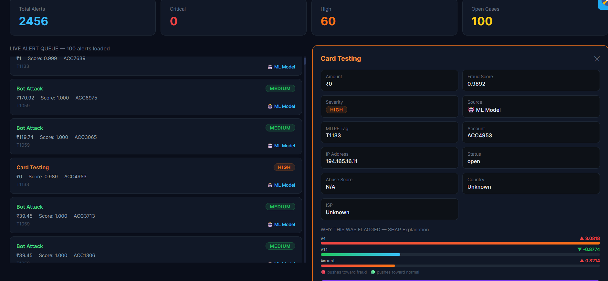
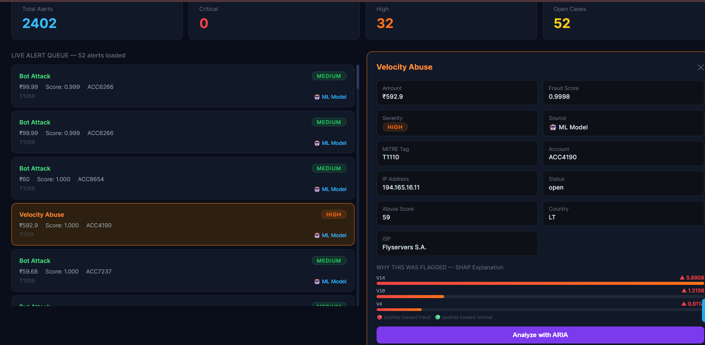
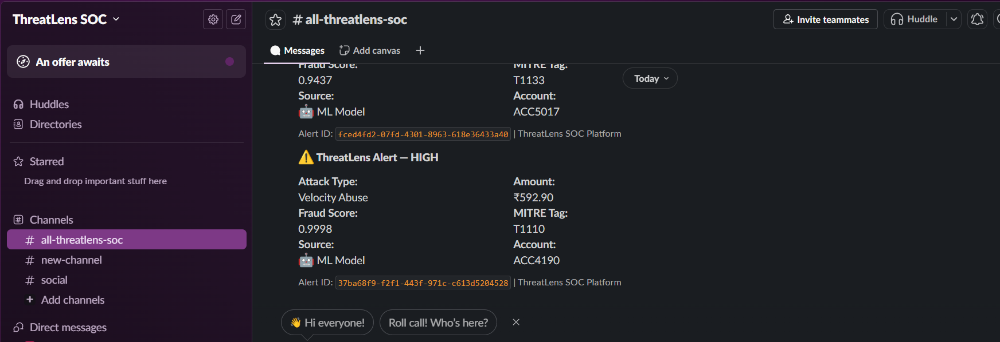

# ThreatLens — AI-Powered Security Operations Platform

> A production-grade SOC platform for UPI fraud detection, SIEM integration, and AI-assisted incident response.

[](https://threat-lens-weld.vercel.app)
[](https://threatlens-em87.onrender.com/docs)
[](https://github.com/lvb05/ThreatLens)

---


#### Dashboard

---


## 🚀 Overview

ThreatLens is a production-grade **AI-powered Security Operations Center (SOC) platform** built for detecting UPI fraud in real time.

It combines:

- **Machine Learning fraud detection**
- **SIEM-based detection engineering**
- **MITRE ATT&CK mapped alerting**
- **AI SOC analyst for incident triage**
- **Real-time dashboard monitoring**
- **Purple team attack simulation**
- **Automated PDF reporting**
- **Slack critical alerting**

This project simulates how a real SOC handles financial fraud incidents from detection to response.

---

## 🌐 Live Deployment

Frontend:
https://threat-lens-weld.vercel.app

Backend API:
https://threatlens-em87.onrender.com/docs


> Video-[Demo](screenshots/threatlens.mp4)

---


## Key Features

### 🔍 Fraud Detection Engine
- XGBoost-based fraud detection model
- Real-time UPI transaction monitoring
- Multiple fraud scenario detection:
  - Card Testing
  - Velocity Abuse
  - Large Fraud
  - Account Takeover
  - Bot Attack

### 🛡️ SIEM Integration
- Wazuh SIEM integration
- Custom XML detection rules
- Sigma detection rules
- MITRE ATT&CK mapping
- Real log ingestion pipeline

### 📊 SOC Dashboard
- Live WebSocket alert feed
- Severity triage
- Case management workflow
- Alert drill-down view
- Threat context visualization

### 🧠 Explainable AI
- SHAP explainability for fraud predictions
- Top contributing feature visualization
- Transparent ML decision-making

### 🤖 ARIA — AI SOC Analyst
AI-powered incident response assistant that provides:
- Executive summaries
- Risk analysis
- MITRE technique explanation
- Response recommendations
- Analyst-style incident triage

### 📄 Incident Response
- One-click PDF report generation
- Slack webhook alerting
- Incident workflow tracking

### ⚔️ Purple Team Simulation
- Fraud attack simulations
- Detection validation
- SOC pipeline testing

---

## 🏗️ Architecture

```
┌─────────────────────────────────────────────────────────────┐
│                    ThreatLens Architecture                  │
└─────────────────────────────┬───────────────────────────────┘
                              │
                              │
             ┌────────────────▼─────────────────┐
             │  fraud_generator.py              │
             │  Writes UPI logs to:             │
             │  /var/log/upi_transactions.log   │
             └────────────┬─────────────────────┘
                          │ 
                          │ file monitoring
                          │
             ┌────────────▼─────────────────────┐
             │  Wazuh Manager 4.7               │
             │  Custom rules: fraud_rules.xml   │
             │  MITRE ATT&CK mapping            │
             └────────────┬─────────────────────┘
                          │ 
                          │ alerts.json
                          │
             ┌────────────▼─────────────────────┐
             │  bridge.py                       │
             │  Tails Wazuh alerts              │
             │  POSTs to FastAPI                │
             └────────────┬─────────────────────┘
                          │ 
                          │ HTTP POST
                          │
                    Cloud (Production)
             ┌────────────▼─────────────────────┐         ┌─────────────────┐
             │  FastAPI Backend (Render)        │───────▶│ Supabase         │
             │  - Alert ingestion               │         │ PostgreSQL      │
             │  - XGBoost ML scoring            │         │ (Mumbai)        │
             │  - SHAP explainability           │         └─────────────────┘
             │  - ARIA AI analyst (Groq)        │
             │  - PDF report generation         │         ┌─────────────────┐
             │  - Slack notifications           │───────▶│ Slack Webhook    │
             │  - WebSocket broadcast           │         │ Critical alerts │
             └────────────┬─────────────────────┘         └─────────────────┘
                          │ WebSocket + REST
                          │
             ┌────────────▼─────────────────────┐
             │  React Frontend (Vercel)         │
             │  - Live alert queue              │
             │  - SHAP visualization            │
             │  - Case management               │
             │  - ARIA chat interface           │
             │  - PDF export                    │
             └──────────────────────────────────┘
```

---

## Tech Stack

### Frontend
- React
- Vite
- Tailwind CSS

### Backend
- FastAPI
- SQLAlchemy
- WebSockets

### Machine Learning
- XGBoost
- SHAP
- Scikit-learn
- Pandas
- NumPy

### Security / SIEM
- Wazuh
- Sigma Rules
- MITRE ATT&CK

### Infrastructure
- Supabase PostgreSQL
- Render
- Vercel
- Slack Webhooks

### AI
- Groq API
- LLaMA 3

---

## 📂 Project Structure

```bash
ThreatLens/
│
├── backend/
│   ├── app/
│   ├── requirements.txt
│
├── frontend/
│   ├── src/
│
├── ml/
│   ├── train_model.py
│   ├── fraud_model.pkl
│   └── shap_explainer.pkl
│
├── wazuh/
│   ├── fraud_generator.py
│   ├── bridge.py
│   ├── fraud_rules.xml
│   └── sigma/
│
├── attack_simulation/
├── screenshots/
└── docs/
```

---

## ⚙️ Local Setup

### Clone Repository

```bash
git clone https://github.com/lvb05/ThreatLens.git
cd ThreatLens
```

---

### Backend Setup

```bash
cd backend

python -m venv venv

# Windows
venv\Scripts\activate

# Linux/Mac
source venv/bin/activate

pip install -r requirements.txt
```

Create `.env`

```env
DATABASE_URL=your_database_url
SECRET_KEY=your_secret_key
GROQ_API_KEY=your_groq_api_key
SLACK_WEBHOOK_URL=your_slack_webhook
```

Run backend:

```bash
uvicorn app.main:app --reload
```

---

### Frontend Setup

```bash
cd frontend
npm install
npm run dev
```

---

### ML Model Training

```bash
python ml/train_model.py
```

---

### Wazuh Integration

Ubuntu VM:

```bash
python3 fraud_generator.py
sudo python3 bridge.py
```

---

## Detection Scenarios

ThreatLens detects:

- Card Testing
- Velocity Abuse
- Large Fraud
- Account Takeover
- Bot Activity

Mapped to MITRE ATT&CK techniques for security analyst visibility.

---

## 📸 Screenshots

#### Dashboard

#### Slack Alerts



---

